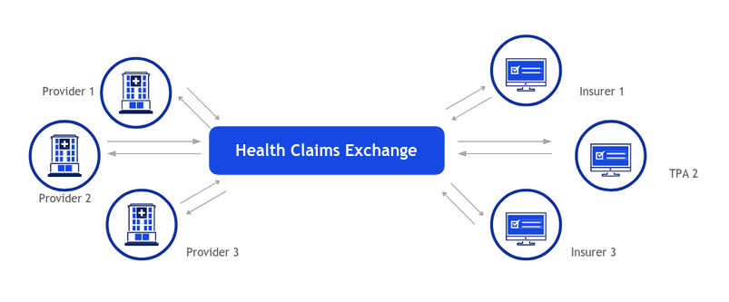

# Cover Note

Health Claims Data Exchange - Open Specifications

Need for the new approach, Overview, Open Specifications as fundamental building blocks

## Need for a new approach

### Overview of the Current Process

The current claims filing and processing experience is fairly manual in nature.

Patients usually reach the hospital and provide the hospital with either the policy details or a card issued by the TPA. The Hospital fills out the pre-auth / claim form by hand, scans all the required documents that need to be part of the claim, and sends these to the appropriate Insurance or TPA typically over email. Several TPA / Insurers also provide hospitals with their own electronic portal where their claims can be submitted as an alternative to email.

On receipt of the pre-auth / claim form, the Insurer / TPA verifies and digitizes the form in the software they use internally for claims processing. The team then adjudicates the claims. A large portion of adjudication in India is currently manual while many developed markets auto-adjudicate over 90% of their claims.

A response to the pre-auth / claim is sent back to the hospital over email. Payments are done electronically and notifications for payment advice are sent via email.

All Insurers have to report claim details in a specified format to the Insurance Information Bureau of India \(IIB\). This is done on a monthly basis by each Insurer.

_\(_[_Reference: NHA IRDAI Joint Working Group Report_](https://pmjay.gov.in/sites/default/files/2019-09/Sub%20Group%20on%20Common%20IT%20Infrastructure%20Report_11-09-19.pdf)_\)_

### Challenges of the Current Process

* The current claims exchange process is not standardized across the ecosystem
* Most data flow is PDF/Manual
* High variability of process between Insurer/TPA/Provider

This results in:

* Multiple follow-ups, lack of visibility
* Long receivable cycles
* High cost of processing
* Poor scalability
* Poor patient experience

## What is HCX

The envisioned claims network can be thought of as analogous to the internet in general and email exchange networks more specifically, where data packets travel to and fro between an origin and the destination. In this context, Health Claims Data Exchanges can be thought of as routing switches or email gateways that facilitate communication with the desired level of consistency, security, privacy and durability. However, unlike the internet or email, this protocol is defined for a specialised use case of exchanging claims related information between relevant actors - payors, providers, beneficiaries, regulators, observers.

Figure below shows a simple depiction of health claims network facilitate by an HCX instance:

#### 

### Vision, Mission and Objectives

1. Expand Insurance Penetration
   1. Significantly lower cost of claims processing implies new use cases – such as OPD and Pharmacy
   2. New kinds of payors in market leading to Increase in insured base
   3. Reduce receivable cycles and increase acceptance of cashless claims \(even in smaller hospitals\)
2. Facilitate insurance innovation
   1. Highly personalised policies
   2. Short duration, low premium policies
   3. Auto adjudication, better fraud and abuse prevention
3. Simplify and bring efficiency to claims processing
   1. Standardised claims process, less operational overheads
   2. Increase trust among payers and providers through a transparent, rule based mechanism
4. Better patient experience

### Key Use cases/Workflows

In its initial version, HCN is focused on facilitating message exchange for cashless claims process and envisions to facilitate following information flows:

1. Get Provider/Payor details
2. Eligibility Check
3. Pre auth request flow
4. Claims request flow
5. Payment Notification
6. Payment acknowledgement, and
7. Search/fetch claims data for status checks, regulatory compliance etc.

### Key constituents

The claims network will consist of the following key building blocks:

1. **Specifications** - this layer defines the blueprint for different aspects of the claims network. These include communication protocols, data packet specifications, Taxonomies, privacy and security specifications, network policies \(onboarding and deboarding rules\), business rules, operational specifications etc. Please note that the document intentionally calls these artefacts as specifications to indicate that they become standards only after a “de jure” or “de facto” adoption by the ecosystem.
2. **Reference Health Claims Exchange \(aka switch\) software** - A reference gateway implementation build as per the standards defined above. The main goal here will be to provide fundamental software building blocks of the network to enable faster adoption by the ecosystem.
3. **Compliance sandbox** - Implemented using the above reference software, the key goal of the sandbox will be to help the ecosystem test its specific components against the network standards defined above and get certified to become part of the network.
4. **Health Claim Platform runtime\(s\)** - Operating instances of the health claims platform that enable real-world claims interactions on the network. Like with the internet and email example, there can be multiple such running instances that are expected to be interoperable by adhering to the standards defined as in \#1 above.
5. **Participating platforms** - These are digital systems of the network participants \(Payors, Providers, Regulators, Observers, etc\) that sit on the edges of the claims network and initiate/receive the communication happening through the network. These would be analogues to client/servers in the internet analogy and various email service providers in the email analogy.

## Open Specifications as fundamental building block

Specifications here refer to the blueprint of each aspect of the envisioned claims data exchange. In this context, the specifications can be thought of as a collection of minimal requirements and definitions which helps participants on the claims data exchange to -

* Coexist and inter-operate correctly with each other \(e.g. Provider/Payor, HCX1/HCX2\)
* Speed up time to market for the new data exchange use cases
* Define and meet the necessary regulations/policies
* Allow participants the choice of technology/solutions

In order to foster collaborative work while still maintaining consistency, envisioned specifications should adhere to key design principles as follwos:

### Design Principles

Specifications are fundamental to the success of the envisioned claims data exchange. In order to ensure that they can act as this common foundation, this section proposes design principles for the open specifications in line with basic principles outlined in the National Digital Health Blueprint.

#### Open

Specifications must be designed to be open to support technology and vendor neutrality. They must be published under the most unrestricted license \(Creative Commons or MIT license\) as applicable to enable wider ecosystem participation and foster innovation through extensibility. Being Open also helps leverage wider ecosystem expertise at the time of designing and evolving the specifications.

#### Evolvable and Extendable

They must be designed to be evolvable over a period of time thereby helping adapt to changing needs. By being extendable they provide ecosystems with the capability to leverage these specifications for their context while maintaining interoperability.

#### Minimalistic and Inclusive

Minimalism is crucial to ensuring that specifications enable and do not restrict innovation or inclusion.

#### Balance data privacy and security with data empowerment

They must provide for the mechanisms to keep the data secure \(e.g. mandating SSL for data in transit, requiring relevant data to be encrypted\) and private \(e.g. consent-based data access\) while still allowing for mechanisms to exchange needed information between trusted parties.

#### Provide for non-repudiability

They must provide mechanisms to view and verify attribute trails - who accessed or updated what and when - through mechanisms like digital signatures and tamper-proof audit trails.

#### Unbundled

They should strive to break down complexity of the domain into multiple simple pieces thereby resulting in multiple simple specifications which can be bundled in a modular manner to suit the needed context and help solve dynamic challenges.

Based on the areas they address, key specifications for the claims data exchange are:

### Key specifications for Health Claims Data Exchange

#### Open protocol for claims data exchange - Health Claims Transfer Protocol

Like HTTP or SMTP, open protocol for claims exchange will define following key aspects:

1. Authentication \(Payor, Provider, Regulator, Observer, ...\)
2. Request/response message syntax - header and header attributes, optional body, mandatory vs optional, transport constraint on the messages etc
3. Supported methods \(APIs\)
4. Communication mode \(synchronous or asynchronous nature of APIs\)
5. Response codes
6. Data security and privacy considerations: Security, authenticity and non repudiability aspects of message exchange
   1. Encryption of certain parts of message for transport security \(beyond SSL on Health Claims data exchange\)
   2. Message signing protocol for verifiability and non-repudiation
7. Sequence of interactions

#### TechOps policy specifications

These will include following policies for participation on the health claims data exchange:

1. Onboarding policies - How does any entity get on board on the data exchange? Adherence to protocol, process for compliance review, frequency of compliance review, etc
2. Deboarding policies: What makes an entity to be blocked or ejected from the data exchange. Things like adherence to technical SLAs, non-compliance with expected protocol versions, message security or privacy violations etc.
3. Access control policies - Role based, need for consent to access APIs, data attributes etc
4. Exchange Operation policies
   1. Key rotation requirements
   2. Segregation of duties and responsibilities within various teams of exchange operators
   3. Operational reports and dashboards
   4. Audit checklist and frequency

#### Domain Data Specifications

Specifications about format and definition of domain data. A lot of these may be adopted from existing domain standards like FHIR, SnoMed, ICD-10 PCS. In the context of claims data exchange few key focus areas will be:

1. **Domain data model** - Schema definition of domain entities like Claims, Providers, Payors, Policies etc. Please note that based on available DSLs some of these data models may be flexible, e.g. policy schema if Policy Markup Language \(PML\) is available.
2. **Metadata specifications -** Metadata is data about data, data associated with an object, a document, or a dataset for purposes of description, administration, technical functionality and preservation. For the context of claims, this would mainly involve coding systems and suggested values for key claim attributes like disease codes, procedure code, diagnostic codes, billing related codes \(e.g. room rent, ICU charges etc.\) etc.
3. **Domain Specific Language\(s\)** - Usually known as DSL, these may be developed When the attributes of the entity are variable from use case to use case but need to adhere to some common constraints/characteristics like types of data element it can contain, relationship between two data elements, number of occurrences of data elements, etc. Examples of such entities within a claims data exchange would be policies, bills, contracts. In such cases, defining a markup language \(DSL\) rather than entity itself allows needed flexibility to the ecosystem to innovate on such entities. These can be thought of like HTML, where multiple flavors of web pages can be defined using the markup elements.

#### Business Policy Specifications

A thriving data exchange will also require clear rules of engagement to ensure trust from all actors. These specifications will involve guidelines around:

1. Access control \(Data sharing\) policies - which actor plays what role and gets to see which parts of data. These policies will then affect the visibility and access to domain specific attributes that will typically travel in the body of the data structures defined by the data exchange.
2. Business SLAs
3. Charges and fees - This would be policies around charges various data exchange entities will be allowed to levy on others depending on the role they play
4. Dispute resolution policies
5. Onboarding
6. Defaulting/Deboarding policies
7. Service rating policies - What would be the parameters and mechanisms to rate each type of actor on the data exchange.

### Approach for Open Specifications

As evident, creation of effective specifications will require a robust process and deep collaboration between multiple stakeholders. In its documentation on “[Understanding the Standards Process](https://confluence.hl7.org/display/HL7/Understanding+the+Standards+Process)”, HL7 aptly mentions the following five must have criterions to meet adoption goals and achieve desired outcomes. The process must:

1. [Foster consensus](https://confluence.hl7.org/pages/viewpage.action?pageId=66920956#UnderstandingtheStandardsProcess-consensus),
2. Ensure content is [fit for purpose](https://confluence.hl7.org/pages/viewpage.action?pageId=66920956#UnderstandingtheStandardsProcess-fit),
3. Ensure content is [implementable](https://confluence.hl7.org/display/HL7/Understanding+the+Standards+Process#UnderstandingtheStandardsProcess-implementable),
4. Establish an appropriate [implementer community](https://confluence.hl7.org/display/HL7/Understanding+the+Standards+Process#UnderstandingtheStandardsProcess-community), and
5. Ensure ongoing [maintenance of the standard](https://confluence.hl7.org/display/HL7/Understanding+the+Standards+Process#UnderstandingtheStandardsProcess-maintenance).

Keeping this in mind, development and maintenance of standards need to be done through a consensus based process by committed group\(s\) that can bring together necessary skills and networks. To achieve this objective, open specifications efforts have been divided into following broad categories. Links on the categories point to the detailed document on each of these specifications:

1. [Technology Specifications](https://docs.google.com/document/d/1cPhhjpvISiMx5SC2UWzG76vrPXKD7jdzXtGOM--cyUI/edit?usp=sharing)
   1. Open protocol
   2. TechOps policy specifications
2. [Domain Specifications](https://docs.google.com/document/d/18ccqHpQi3RJBrt33bZvd_R-e1CeP8CvvjiWZkWHG5E4/edit?usp=sharing)
   1. Domain data specifications
   2. Business policy specifications

#### Proposed development process

1. Specifications in both categories are developed, maintained and enhanced using an open process similar to [opengroup](https://www.opengroup.org/) or [hl7](https://www.hl7.org/implement/standards/). Broad outline of the process would be:
   1. Working groups create clear criterions for evaluation of a proposal
   2. Idea for a new specifications/enhancement is proposed by one of the group members
   3. Working group’s governance committee evaluates the idea
   4. If OKed, development/enhancement begins
   5. Resultant specifications/enhancement from point \(point \(c\)\) above is reviewed by peer group for implementability
   6. The resultant specifications/enhancement is put out for public consultation
   7. The working group reviews public consultation feedback and incorporates the necessary changes. Any feedback not included should be appropriately responded to
   8. Specifications are published for wider adoption
2. Specifications in both categories are maintained in open repositories like github, confluent \(or similar\) based on the nature of the output.
3. In keeping up with the construct of Open Specifications, specifications in both categories are made available through most permissible licenses like MIT or Creative Commons.

